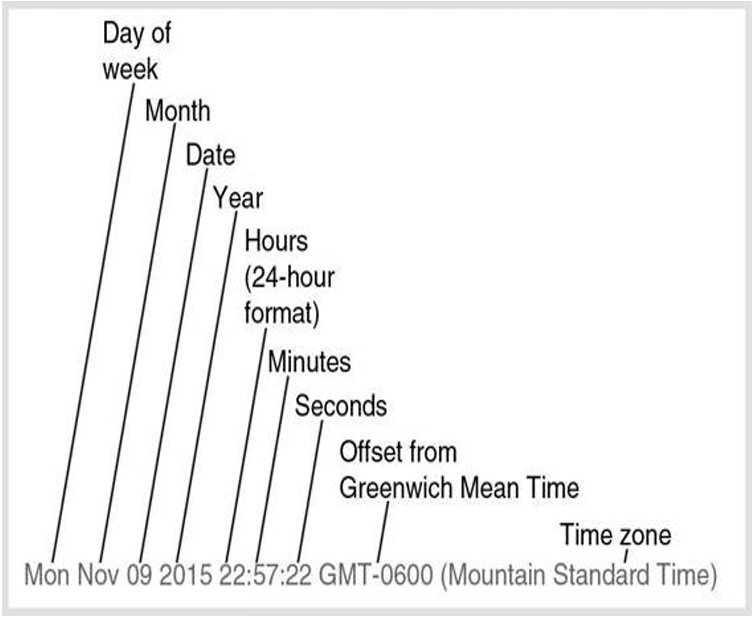
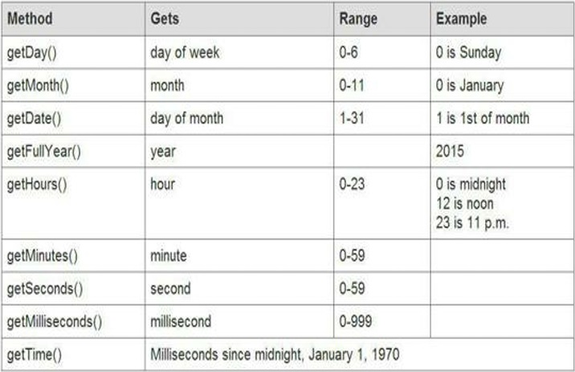

# JavaScipt-Docs

# JavaScript Keywords
| abstract | final | protected |
|---|---|---|
| as | finally | public |
| boolean | float | return |
|break|for|short|
|byte|function|static|
|case|goto|super)|
|catch|if|switch|
|char|implements|synchronized|
|class|import|this|
|continue|in|throw|
|const|instanceof|throws|
|debugger|int|transient|
|default|interface|true|
|delete|is|try|
|do|long|typeof|
|double|namespace|use|
|else|native|var|
|enum|new|void|
|export|null|volatile|
|extends|package|while|
|false|private|with|

# Alert
```
alert("Hello World!");
```
# Variables
```
var name = "Idrees";
var nationality = "Pakistan";
var weight = "150";
var caseQty = 144;
```
# Math expressions
```
var commonNumber = 2 + 2;
var commonNumber = 12 - 24;
var commonNumber = 4 * 12;
var num = 10;
var commonNumber = 300;
var commonNumber = 15 / 4;
var remainder = 15 % 4;
```
### increment / decrement
```
num++; //post increment
num--; //post decrement
++num; //pre-increment
--num; //pre-decrement
num = num + 1;
num = num - 1;
```
### Eliminating ambiguity
```
var totalCost = 4*12+3+120*5;
var totalCost = 4*(12+3)*2+3 //123
var totalCost = 4*(12+3)*(2+3) //300
```
# Concatenating Text String
```
var message = "Assalamo Alaikum";
var name = "Idrees";
var username = "Norman"
alert(message +" "+ name)	//"Assalamo Alaikum Idrees"
alert("Thanks " + username)	//"Thanks Norman"
```
# Prompts
```
var name = prompt ("What's your name?");
var numberOfPets = prompt ("How many pets?");
```
# *if* statements
```
var x = prompt("What is the biggest continent in the world?");
if (x === "Asia") {
	alert("Correct");
}
```

### Comparision operators
\> is greater than
\< is less than
\>= is greater than or equal to
\<= is less than or equal to
\=== is equal to (match type and value both)
\== is equal to (math only value)
!== is not equal to (true if either the value or type does not match)
!= is not equal to (true if the value does not match regardless of the type)


```
if (1 > 0) {...code...}
if (0 < 1) {...code...}
if (1 >= 0) {...code...}
if (1 >= 1) {...code...}
if (1 <= 1) {...code...}
```
# *if*... *else* and *elseif* statements
### if (true)
```
var x = prompt("Which is the biggest continent in the world?");
if ( x === "Asia") {
	alert("Correct!");
}
```
### if (true) or if(false)
```
var x = prompt("Which is the biggest continent in the world?");
if ( x === "Asia") {
	alert("Correct!");
}
if (x !== "Asia") {
	alert("Wrong answer");
}
```
### if (true) or else
```
var x = prompt("Which is the biggest continent in the world?");
if ( x === "Asia") {
	alert("Correct!");
}
else {
	alert("Wrong answer");
}
```
### if, elseif, else
```
var correctAnswer = "Asia";
if (x === correctAnswer) {
	alert("Correct!");
}
elseif (x ==="Africa") {
	alert("Incorrect but close");
}
else {
alert ("Incorrect");
}
```
# Testing sets of conditions
Consider an School has a 100 meter running test for the criteria to qualify  to join sport team.

### SET I
```if (weight > 120 && time < 20) {...```
The above conditional statement checks two conditions that are combined with "**&&**" operator which literally means "**and**".  So, we can read the above conditional statement as " if a man has weight more than 120 pound **and** runs 100 meter under 20 sec, he can join school's sport team. Therefore, the both the conditions must be **true** to execute this block of code.
|weight > 120| time < 20|
|---|---|

### SET II
```if (weight > 120 && time < 20 && age > 17 && gender === "male") {...```
This set of conditions has four criteria, which are combined with "**&&**" that means all the four conditions must be **true** to meet the criteria.
|weight > 120| time < 20|age > 17|male|
|---|---|---|---|

### SET III
```if (SAT || avg || GPA > 2.5 || sport === "football") {...```

|SAT score avg |GPA > 2.5| sport football|
|---|---|---|

### SET IV
```if (age > 65 || age < 21 && res === "Pakistan") {...```

|age > 65 or age < 21 | Resident of Pakistan|
|---|---|

|age > 65 | age < 21 or Resident of Pakistan |
|---|---|

### SET V
```if ( (age > 65 || age < 21 ) && res === "Pakistan") {...```

|age > 65 or age < 21 | Resident of Pakistan|
|---|---|

### SET VI
```if (age > 65 || (age < 21 && res === "Pakistan") ) {...```

|age > 65 | age < 21 or Resident of Pakistan |
|---|---|

<hr>

# *if* statements nested

Check out this code.
```
if ((x === y || a === b ) && c === d) {
	g = h;
}
else {
	e = f
}
```

and this (nested if statements)
```
if (c === d) {
	if(x === y ) {
		g = h;
	}
	else if (a === b) {
		g = h;
	}
	else {
		e = f;
	}
}
else {
	e = f;
}
```
<hr>

<hr>

# Arrays
Assigning of some string values to some variabls.

```
var city0 = "Karachi";
var city1 = "Lahore";
var city2 = "Islamabad";
var city3 = "Faisalabad";
var city4 = "Multan";
var city5 = "Peshawar";
var city6 = "Quetta";
```
This is how we can create an array under a single container;

```
var cities = ["Karachi", "Lahore", "Islamabad", "Faisalabad", "Multan", "Peshawar", "Quetta"];
```

Mixed array
```
var mixedArray = [23, "Idrees", true, "2023"];
```

# Arrays: Adding and removing elements

You can assign or change a variable values whenever you like
```
var pets = [];
pets[0] = "dog";
pets[1] = "cat";
pets[2] = "bird";
pets[3] = "lizard";
pets[4] = "snake";

console.log(pets) // ['dog', 'cat', 'bird', 'lizard', 'snake']
```

## array.pop
Using the **pop** keyword, you can remove the last element of an array.

```
pets.pop();
console.log(pets)	//['dog', 'cat', 'bird', 'lizard']
```

## array.push
Using the **push** keyword, you can add one or more elements to the end of an array.

```
pets.push("fish", "ferret");
console.log(pets);	['dog', 'cat', 'bird', 'lizard', 'fish', 'ferret']
```

## array.shift
Use the **shift** method to remove an element from the beginning of an array.

```
pets = ['dog', 'cat', 'bird', 'lizard', 'fish', 'ferret'];
pets.shift();

console.log(pets);	//['cat', 'bird', 'lizard', 'fish', 'ferret'];
```

## array.unshift
use the **unshift** method to add one or more elements to the beginning of an array.

```
pets = ['cat', 'bird', 'lizard', 'fish', 'ferret'];
pets.unshift('lion', 'elephant');

console.log(pets)	//['lion', 'elephant', 'cat', 'bird', 'lizard', 'fish', 'ferret'];

```

## array.splice 

**using splice method to insert and remove simultaneously**
Use the **splice** method to insert one or more elements anywhere in an array, while optionally, removing one or more elements that come after it.
The following code 

```
pets = ['lion', 'elephant', 'cat', 'bird', 'lizard', 'fish', 'ferret'];
pets.splice(2, 2, "pig", "duck", "emu");

console.log(pets)	//['lion', 'elephant', 'pig', 'duck', 'emu', 'lizard', 'fish', 'ferret'];
```

in the above code, the first argument of splice method **2** the give elements (here; "pig", "duck", and "emu") to add from the index of **2**.
the second argument **2** means, to remove **2 items** next to it (here; "cat", "bird").
and the following arguments are the elements to be add.

**using splice method to insert new elements only**
you could make additions without removing any elements

```
pets = ['lion', 'elephant', 'cat', 'bird', 'lizard', 'fish', 'ferret'];
pets.splice(2, 0, 'pig', 'duck', 'emu');
console.log(pets);	

//output: (10) ['lion', 'elephant', 'pig', 'duck', 'emu', 'cat', 'bird', 'lizard', 'fish', 'ferret']
```

## array.slice
**use the slice method to copy one or more any consecutive elements in any position and put them into a new array**

```
pets = ['lion', 'elephant', 'cat', 'bird', 'lizard', 'fish', 'ferret'];
var newPets = pets.slice(2,4);
console.log(newPets);

//output (2) ['cat', 'bird']
```

<hr>

# for loops

```
var cleanestCities = ["helsinki", "islamabad", "melbourne", "oslo", "bogota", "minneapolis"];
var cityToCheck = "islamabad";

//forloop syntax with simple example
for (var i = 0; i<=4; i++ ) {
	if (cityToCheck ===cleanestCities[i]) {
		console.log("It's one of the cleanest cities");
	}
}
//output "It's one of the cleanest cities"
```

# for loops nested

```
var firstNames = ["Idrees", "Ishaq", "Hamza", "Usman", "Irfan"];
var lastNames = ["Ali", "Ahmed", "Siddiq", "Hashim"];
var fullNames = [];
for (var i = 0; i < firstNames.length; i++) {
	for (var j = 0; j < lastNames.length; j++) {
		fullNames.push(firstNames[i] +" "+ lastNames[j])
	}
}
console.log(fullNames);

//output (20) ['Idrees Ali', 'Idrees Ahmed', 'Idrees Siddiq', 'Idrees Hashim', 'Ishaq Ali', 'Ishaq Ahmed', 'Ishaq Siddiq', 'Ishaq Hashim', 'Hamza Ali', 'Hamza Ahmed', 'Hamza Siddiq', 'Hamza Hashim', 'Usman Ali', 'Usman Ahmed', 'Usman Siddiq', 'Usman Hashim', 'Irfan Ali', 'Irfan Ahmed', 'Irfan Siddiq', 'Irfan Hashim']
```

<hr>

# Changing case

## toLowerCase()
```
var cities = ["karachi", "HyderAbad", "LahOre", "PesHaWar", "IsLamABAD"];
var citiesInLowerCase = [];
for (var i =0 ; i < cities.length; i++ ) {
	citiesInLowerCase.push(cities[i].toLowerCase());
}
console.log(citiesInLowerCase);

//output: (5) ['karachi', 'hyderabad', 'lahore', 'peshawar', 'islamabad']
```

## toUpperCase()

```
var cities = ["karachi", "HyderAbad", "LahOre", "PesHaWar", "IsLamABAD"];
var citiesInUpperCase = [];
for (var i =0 ; i < cities.length; i++ ) {
	citiesInUpperCase.push(cities[i].toUpperCase());
}
console.log(citiesInUpperCase);

//output: (5) ['KARACHI', 'HYDERABAD', 'LAHORE', 'PESHAWAR', 'ISLAMABAD']
```

<hr>

# Strings
## Strings: Measuring length and extracting parts

### extracting first character
```
var firstChar = "idrees".slice(0,1);
console.log(firstChar);		//output: "i"
```
### extracting remaining characters

```
var someChars = "idrees".slice(1,6);
console.log(someChars);		//output: "drees"
```
or you can omit the second argument inside the parenthese, either for precise or if you don't know the lenght of the text, JavaScript includes all the characters to the end of the string. 

```
var someChars = "idrees".slice(1);
console.log(someChars);		//output: "drees"
```

### to Capitalize
Now we have a way to capitalize the first characters of a string and insure that the remaining letters are lower-case.

```
var myName = "idreEs";
var capName = myName.slice(0,1).toUpperCase() + myName.slice(1).toLowerCase();
console.log(capName);

//output: Idrees
```

Similarly, we can capitalize the every element of an array list.
```
var cities = ["karachi", "HyderAbad", "LahOre", "PesHaWar", "IsLamABAD"];
var citiesToCap = [];
for (var i =0 ; i < cities.length; i++ ) {
	citiesToCap.push(cities[i].slice(0,1).toUpperCase() + cities[i].slice(1).toLowerCase());
}
console.log(citiesToCap);

//output: (5) ['Karachi', 'Hyderabad', 'Lahore', 'Peshawar', 'Islamabad']
```

### check double space
You can use the `slice` method for space limitation.

```
var str = prompt ("Enter some text");
var numChars = str.length;
for (var i = 0; i < numChars; i++){
    if (str.slice (i,i+2) === "  "){
        alert ("No double space!");
    }
}
```

## Strings: Finding Segments
### Finding and replace an string segments without any method
The below code will find the text "javascript" and change it with "JavaScript".

```
var text = "javascript, often abbreviated as JS, is a programming language that is one of the core technologies of the World Wide Web,alongside HTML and CSS. As of 2023, 98.7% of websites use javascript on the client side for webpage behavior, often incorporating third-party libraries.javascript was invented by Brendan Eich in 1995. Javascript is a case-sensitve language and an interpreted language.";

for (var i = 0; i < text.length; i++){
    if (text.slice(i,i+10) === "javascript"){
        text = text.slice(0,i) + "JavaScript" + text.slice(i+10);
    }
}
console.log(text);
```

### Finding and replace with method `indexOf`
JavaScript has a more efficient way to accomplish the above task, using the `indexOf` method.

```
var firstChar = text.indexOf("javascript");
console.log(firstChar);
```

Now, we can replace the incorrect spelling "javascript" with the correct and official spelling of "JavaScript" (with a capital "J" and "S") with less coding.

```
var text = "javascript, often abbreviated as JS, is a programming language that is one of the core technologies of the World Wide Web,alongside HTML and CSS. As of 2023, 98.7% of websites use javascript on the client side for webpage behavior, often incorporating third-party libraries.javascript was invented by Brendan Eich in 1995. Javascript is a case-sensitve language and an interpreted language.";

var firstChar = text.indexOf("javascript");
    if(firstChar !== -1){
        text = text.slice(0, firstChar) + "JavaScript" + text.slice(firstChar+10);
    }
console.log(text);
```

**Limitation**
- If the segment doesn't exit, the method assigns -1
- The `indexOf` method finds only the first instance of the segments you're looking for. You could overcome this limitation by looping.

### overcome the limitation with looping

```
var text = "javascript, often abbreviated as JS, is a programming language that is one of the core technologies of the World Wide Web,alongside HTML and CSS. As of 2023, 98.7% of websites use javascript on the client side for webpage behavior, often incorporating third-party libraries.javascript was invented by Brendan Eich in 1995. Javascript is a case-sensitve language and an interpreted language.";

var searchTerm = "javascript";
var replacementTerm = "JavaScript";

var firstChar = text.indexOf(searchTerm);

while (firstChar !== -1) {
    text = text.slice(0, firstChar) + replacementTerm + text.slice(firstChar + searchTerm.length);
    firstChar = text.indexOf(searchTerm);
}

console.log(text);
```

Similarly, to find the last instance of a segment in a string, use `lastIndexOf`.

```
var text = "To be or not to be";
var segIndex = text.lastIndexOf("be");
console.log(segIndex);

//output: 16
```

## Strings: Finding a character at a location
You already know
```
var firstName = "Idrees";
var firstChar = firstName.slice(0,1);
console.log(firstChar);     //output: "I";
```

Here's is alternate way to do it that's more direct.
```
var firstName = "Idrees";
var firstChar = firstName.charAt(0);
console.log(firstChar);     //output: "I";
```

The following code finds the last character in the string
```
var firstName = "Idrees";
var firstChar = firstName.charAt(firstName.length-1);
console.log(firstChar);     //output: "s";
```

The following code cycles through a string looking for 'At sign' @ symbol. If the character is found, an alert displays.
```
var anEmail = "example@email.com";
for (var i = 0; i < anEmail.length; i++){
    if (anEmail.charAt(i) === "@") {
        alert("At sign found!");
    }
}
```

**Note: The `charAt` method can only identify the character at a particular location. It can't change the character at a location**

**and `indexOf` can find the index of the first occurence of a specified value in a string**

## Strings: Replacing characters
previously, you have leaned two different ways to replace "javascript" with the "JavaScript" in a string.

First **loop-and-slice approach**
```
var text = "javascript, often abbreviated as JS, is a programming language that is one of the core technologies of the World Wide Web,alongside HTML and CSS. As of 2023, 98.7% of websites use this language on the client side for webpage behavior, often incorporating third-party libraries.";

for (var i = 0; i < text.length; i++){
    if (text.slice(i,i+10) === "javascript"){
        text = text.slice(0,i) + "JavaScript" + text.slice(i+10);
    }
}
console.log(text);
```

Second, **using indexOf method**
```
var text = "javascript, often abbreviated as JS, is a programming language that is one of the core technologies of the World Wide Web,alongside HTML and CSS. As of 2023, 98.7% of websites use this language on the client side for webpage behavior, often incorporating third-party libraries.";

var firstChar = text.indexOf("javascript");
    if(firstChar !== -1){
        text = text.slice(0, firstChar) + "JavaScript" + text.slice(firstChar+10);
    }
console.log(text);
```

**But JavaScript provides a more straightforward way still, the `replace` method.**

**Syntax of `string.replace`**
```
var newString = string.replace("segment to be replace", "segment to be insterted");
```

```
var text = "javascript, often abbreviated as JS, is a programming language that is one of the core technologies of the World Wide Web,alongside HTML and CSS. As of 2023, 98.7% of websites use javascript on the client side for webpage behavior, often incorporating third-party libraries. javascript was invented by Brendan Eich in 1995. javascript is a case-sensitve language and an interpreted language.";

var newText = text.replace("javascript", "JavaScript");
console.log(newText);
```

But only the first instance of string is replace, to replace all instances you must let JavaScript know that you want a **global replace**

```
var text = "javascript, often abbreviated as JS, is a programming language that is one of the core technologies of the World Wide Web,alongside HTML and CSS. As of 2023, 98.7% of websites use javascript on the client side for webpage behavior, often incorporating third-party libraries. javascript was invented by Brendan Eich in 1995. javascript is a case-sensitve language and an interpreted language.";

var newText = text.replace(/javascript/g, "JavaScript");
console.log(newText);
```

**Note: In JavaScript, the replace method is used to replace a specified substring or pattern (by using of regular expression as search parameter).**

<hr>

# Numbers

## Numbers: Rounding numbers
For rounding a number there are multiple methods under **Math** object in JavaScript.
`Math.round()`
`Math.ceil()`
`Math.floor()`

### `Math.round()`
- `Math.round()` rounds the number to the nearest integer.
- If the fractional part (decimal) of the number is 0.5 or greater, the number is rounded up by adding 1 to the integer part.
- If the fractional part is less than 0.5, the number is rounded down, and the decimal part is effectively discarded.

**Example**
```
//Rounds up: when the fractional part is 0.5
console.log(Math.round(1.5));   //output: 2
console.log(Math.round(2.5));   //output: 3
console.log(Math.round(-1.5));   //output: -1
console.log(Math.round(-2.5));   //output: -2

//Rounds up: when the fractional part > 0.5
console.log(Math.round(1.51));  //output: 2
console.log(Math.round(1.99));  //output: 2
console.log(Math.round(-1.49));  //output: -1
console.log(Math.round(-1.01));  //output: -1

//Rounds down: when the fractional part < 0.5
console.log(Math.round(1.49));  //output: 1
console.log(Math.round(1.01));  //output: 1
console.log(Math.round(-1.51));  //output: -2
console.log(Math.round(-1.99));  //output: -2
```

### `Math.ceil()`
- Rounds a number up to the nearest integer.
- Always rounds up, even if the fractional part is less than 0.5

**Example**
```
//Rounds up: when the fractional part is 0.5
console.log(Math.ceil(1.5));   //output: 2
console.log(Math.ceil(2.5));   //output: 3
console.log(Math.ceil(-1.5));   //output: -1
console.log(Math.ceil(-2.5));   //output: -2

//Rounds up: when the fractional part > 0.5
console.log(Math.ceil(1.51));  //output: 2
console.log(Math.ceil(1.99));  //output: 2
console.log(Math.ceil(-1.49));  //output: -1
console.log(Math.ceil(-1.01));  //output: -1

//Rounds up: when the fractional part < 0.5
console.log(Math.ceil(1.49));  //output: 2
console.log(Math.ceil(1.01));  //output: 2
console.log(Math.ceil(-1.51));  //output: -1
console.log(Math.ceil(-1.99));  //output: -1
```

### `Math.floor`
- Rounds a number down to the nearest integer.
- Always rounds down, even if the fractional part is 0.5 or greater.

**Example**
```
//Rounds down: when the fractional part is 0.5
console.log(Math.floor(1.5));   //output: 1
console.log(Math.floor(2.5));   //output: 2
console.log(Math.floor(-1.5));   //output: -2
console.log(Math.floor(-2.5));   //output: -3

//Rounds down: when the fractional part > 0.5
console.log(Math.floor(1.51));  //output: 1
console.log(Math.floor(1.99));  //output: 1
console.log(Math.floor(-1.49));  //output: -2
console.log(Math.floor(-1.01));  //output: -2

//Rounds down: when the fractional part < 0.5
console.log(Math.floor(1.49));  //output: 1
console.log(Math.floor(1.01));  //output: 1
console.log(Math.floor(-1.51));  //output: -2
console.log(Math.floor(-1.99));  //output: -2
```

|n|Math.round(n)|Math.ceil(n)|Math.floor(n)|
|---|---|---|---|
|1.5|2|2|1|
|2.5|3|3|2|
|-1.5|-1|-1|-2|
|-2.5|-2|-2|-3|
|1.51|2|2|1|
|1.99|2|2|1|
|-1.49|-1|-1|-2|
|-1.01|-1|-1|-2|
|1.49|1|2|1|
|1.01|1|2|1|
|-1.51|-2|-1|-2|
|-1.99|-2|-1|-2|


## Numbers: Generating random numbers
For generating a random number we have in JavaScript `Math.random()`. It generates **almost a random, technically known as ** *pseudo-random*, with 16 decimal places, ranging from 0.0000000000000000 through 0.9999999999999999.

```
var randomNumber = Math.random();
```

we can convert the decimal to an integer by multiplying by **one hundred quadrillion** (1 followed by 17 zeroes):

**Generate a Random Number from 1 to 6**
Now, if we want to simulate the throw of a die. We want six possible numbers 1 through 6. We multiply the giant decimal number to 6.

```
var randomNumber = Math.random()*6;
```
Here are the three examples

**0.0000000000000000 * 6 = 0**

**0.7554887836835311 * 6 = 4.532932702101187**

**0.9999999999999999 * 6 = 5.999999999999999**

```
var bigDecimal = Math.random();
var improvedNum = (bigDecimal*6)+1;
var rollDice = Math.floor(improvedNum);
console.log(rollDice);
```

## Numbers: Converting strings to integers and decimals

Sometimes, JavaScript seems to read you mind, suppose you are trying to do math works for example multiple (*), divide (/), or subtruct (-) between two strings or one string and the other is number, JavaScript seems to understand that you want the string treated as a number, and does the math.

**Arithmatic operations: when on is string & the other is number**
```
var profit = "200" - 50;
console.log(profit, typeof(profit));    // 150 'number'

var qty = "200" * 50;
console.log(qty, typeof(qty));          // 10000 'number'

var price = "200" / 50;
console.log(price, typeof(price));      // 4 'number'
```

**Arithmatic operations: when the both are string**

```
var profit1 = "200" - "50";
console.log(profit, typeof(profit1));   // 150 'number'

var qty1 = "200" * "50";
console.log(qty, typeof(qty1));         // 10000 'number'

var price2 = "200" / "50";
console.log(price2, typeof(price2));    // 4 'number'
```

If you write
```
var profit = "200" - "pencil";
console.log(profit);        //NaN
```
**NaN** means **not a number**. No mystery here. How can 200 minus pencil a number.

But, If you try to add two strings or a string and a number, JavaScript will do the opposite of what you see in the example above.

JavaScipt concatenates them, rather then adding.
```
var margin = "200" + 50;
console.log(margin, typeof(margin));    // 20050 string

var margin2 = "200" + "50";
console.log(margin2, typeof(margin2));  // 20050 string
```

There is going to be a problem with the code below
```
var currentAge = prompt("Enter your age");
var eligibleToGetLicence = currentAge + 2;
console.log(eligibleToGetLicence);
```
if you give your age to the prompt 18, It treets as a string and rathen than adding 20, It will give "182".

So to avoid this confusion we have methods in JavaScript to convert string into numbers `parseInt(string)` `and parseFloat(string)`

```
var currentAge = prompt("Enter your age");
var eligibleToGetLicence = parseInt(currentAge) + 2;
console.log(eligibleToGetLicence);
```

### `parseInt(string)` and `parseFloat(string)` 
- `parseInt` converts all strings including strings comprising floating point numbers, to integers
- `parseInt` doesn't round. It simply lops off the decimals.
- `parseInt` Ignores leading whitespaces.
- `parseFloat` converts a string to a floating-point number.
- `parseFloat` Ignore leading whitespaces.

**Example**
```
var intNum = parseInt("123");       // Output: 123
var floatNum = parseInt("123.45");        // Output: 123
var intNum2 = parseFloat("123");       // Output: 123
var floatNum2 = parseFloat("123.45");    // Output: 123.45

var intFromStringWithNonDigits = parseInt("123abc"); // Output: 123
var floatFromStringWithNonDigits = parseFloat("123.45abc"); // Output: 123.45

var intFromStringWithLeadingSpaces = parseInt("   123"); // Output: 123
var floatFromStringWithLeadingSpaces = parseFloat("   123.45"); // Output: 123.45
```

In summary,
- use `parseInt` when you want to convert a string to an integer.
- use `parseFloat` when you want to convert a string to a floating-point number.

## Numbers: Converting strings to numbers, numbers to strings

`parseInt` converts a string into an integer and `parseFloat` converts a string representing a number into a floating-point number.

You can finesse the distinction between integers and floating-point numbers by using `Number`

```
var intNum = Number("123");       // Output: 123
var floatNum = Number("123.45");        // Output: 123.45
var floatFromStringWithNonDigits = Number("123.45abc"); // Output: NaN

var intFromStringWithLeadingSpaces = Number("   123"); // Output: 123
var floatFromStringWithLeadingSpaces = Number("   123.45"); // Output: 123.45
```

**Convert numbers to string**

```
var numAsNum = 12345;
var numAsString = numAsNum.toString();
console.log(numAsString);   //output: 12345
```


## Numbers: Controlling the length of decimals

```
var total = 10.596175;
var prettyTotal = total.toFixed(2);
console.log(prettyTotal);   //output: 10.60
console.log(total.toFixed(5));  //output: 10.59618
console.log(total.toFixed(3));  //output: 10.596
```

<hr>

# Date and time

## Getting the current data and time

```
var currentDateTime = new Date();
//output: Wed Nov 29 2023 21:15:45 GMT+0500 (Pakistan Standard Time)
```

The above code create a *Date Object*. This is what it looks like
||
|--|
|*This image is taken from the book "A smarter way to learn JavaScript by Mark Myers.*|


The date object is looking like a string but, it's not. You you cannot use string methods like `slice`, `indexOf`, `charAt` and etc on it.

If you need the *Date object* to be string, you can convert it. As you do a number to a string

```
var dateString = currentDateTime.toString();
```

you can get the Day from the **date object** with the `getDay()` method. The day of today is shown as "Fri" in date object but, `getDay() gives the day as number, 0 "Sunday" through 6 for "Saturday".

You can get the Day Name by making a array of days

```
var daysName = ["Sun","Mon","Tue","Wed","Thu","Fri","Sat"];
var now = new Date();
var theDay = now.getDay();	//3
var nameOfToday = daysName[theDay];
console.log(nameOfToday);	//Wed
```

## Extracting parts of the date and time

||
|--|
|*This image is taken from the book "A smarter way to learn JavaScript by Mark Myers.*|

I have already shown, how to extract day. Similarly we can get day, date, month year etc.

### `getMonth()`
produces a month number from 0 for January to 11 for December.
```
var thisMonth = new Date().getMonth();
```

### `getDate()`
gives you the day of the month.

```
var dayOfMonth = new Date().getDate();
```

### `getFullYear()`
gives you the 4 digit year
```
var currentYear = new Date().getFullYear();
```

### `getHours()`
gives you hour number from 0 to 23 corresponding to midnight through 11 p.m.
```
var currentHours = new Date().getHours();
```

### `getMinutes()`
gives a number from 0 to 59
```
var currentMinuts = new Date().getMinutes();
```

### `getSeconds()`
gives you seconds from 0 to 59
```
var currentSecs = new Date().getSeconds();
```

### `getMilliseconds()`
gives you milliseconds from 0 to 999.
```
var currentMilliSecs = new Date().getMilliseconds();
```

### `getTime()`
gives you the number count of milliseconds that have passed since the start of January 1, 1970, midnight.
```
var millSecSince = new Date().getTime();
```

## Specifying a date and time

create a date object
```
var rightNow = new Date();
```
I am going to find that how many years left *2040 Summer Olympics* to be held. I don't know the exact date, but I pick the middle to the year June 30, to pin down the exact date in 2040.
Now, create a date object with date specifying
```
var olympics2040 = new Date("June 30, 2040");
```

we can calculate the time in milliseconds from a reference date (January 1, 1970) by `getTime()` method and taking a difference from the current date, we can get that how many time is left to **Summer Olympics 2040** be held

```
var msolympics2040 = olympics2040.getTime();
var msRightNow = rightNow.getTime();
var timeLeft = msolympics2040 - msRightNow;
```

Now convert back the time in milliseconds to Years
```
var timeLeftInYrs = timeLeft/1000/60/60/24/365;
console.log(timeLeftInYrs);
```

Here, is the whole code condensed into something that is efficient, abridged and looks more like production code.

```
var timeLeft = new Date("June 30, 2040").getTime() - new Date().getTime();
var yearsTillOlympics2040 = (timeLeft/1000/60/60/24/365);
console.log(yearsTillOlympics2040)
```

You can also specify time, if it means to you.

```
var d = new Date("June 5, 1973 14:20:00");
```
no comma after the date. Colons seperating 24-hour time (hh:mm:ss).


## Changing elements of a date and time

|Method|Example|Result|
|-----|-----|-----|
|setFullYear( )|d.setFullYear(2005)|Year is 2005|
|setMonth( )|d.setFullYear(5)|Month is 5 (June)|
|setDate( )|d.setDate(5)|Day of the month is 5|
|setHours( )|d.setHours(5)|5 a.m|
|setMinutes( )|d.setMinutes(5)|5 Minutes past the hour|
|setSeconds( )|d.setSeconds(55)|55 seconds past the minute|
|setMilliseconds( )|d.setMilliseconds(5)|5 milliseconds past the second|

**note: d is the variable representing the Date object**

### `setFullYear()`
`setFullYear()` sets the **year** of an existing Date object, leaving all other elements of Date object unchanged
```
var d = new Date();
d.setFullYear(1947);
```


### `setMonth()`
`setMonth()` sets the **month** of an existing Date object, leaving all other elements of Date object unchanged
```
var d = new Date();
d.setMonth(7);
```

### `setDate()`
`setDate()` sets the **date** of an existing Date object, leaving all other elements of Date object unchanged
```
var d = new Date();
d.setDate(14);
```

### `setHours()`
`setHours()` sets the **hours** of an existing Date object, leaving all other elements of Date object unchanged

```
var d = new Date();
d.setHours(6);
```

### `setMinutes()`
`setMinutes()` sets the **minutes** of an existing Date object, leaving all other elements of Date object unchanged
```
var d = new Date();
d.setMinutes(5);
```

### `setSeconds()`
`setSeconds()` sets the **seconds** of an existing Date object, leaving all other elements of Date object unchanged
```
var d = new Date();
d.setSeconds(7);
```

### `setMilliseconds()`
`setMilliseconds()` sets the **milliseconds** of an existing Date object, leaving all other elements of Date object unchanged
```
var d = new Date();
d.setMilliseconds(555);
```
<hr>

# Functions

In JavaScript, a function is a reusable block of code that performs a specific task or set of tasks. Functions allow you to organize code into modular units, making it easier to manage, understand, and reuse. Functions does the same thing again and again robotically whenever you invoke its name, no matter how far the defining function block is.  Functions in JavaScript can be defined using the function keyword.

```
function tellMeTime() {
    var now = new Date();
    var theHr = now.getHours();
    var theMin = now.getMinutes();
    alert("The current time is " + theHr + ":" + theMin);
}
	
```
Here is a small function that wraps codes that tell time. When ever you want to know the current time, you don't need to create date object and extract time every time, you just invoke the function by its name including its parenthese.
```
tellMeTime();
```
- You can give any legal variable name to a function.
- Function-naming follows the same rule as variable naming.
- Technically, a function is a varaible.
- In JavaScript, function declarations are hoisted. Hoisting is a behavior where variable and function declarations are moved to the top of their containing scope during the compilation phase, before the code is executed. So, they're called by the main code, they're already loaded in memory and ready to go.


## Functions: Passing them data
```
function greetVisitor(greeting) {
	alert(greeting)
}

```

```
function winnersCall(m, string, num) {
	alert (m + string + num);
}
```
Now here's the statement that calls the function
```
var month = "April";
winnersCall(month, "'s winner number is ", 17);
```

## Functions: Passing data back from them

## Local vs. Global variables

